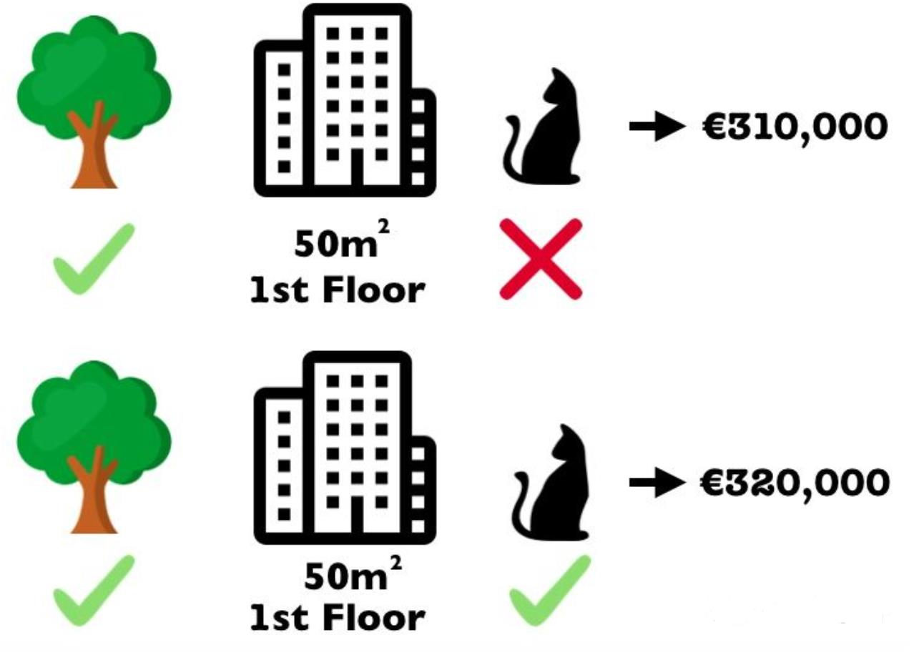
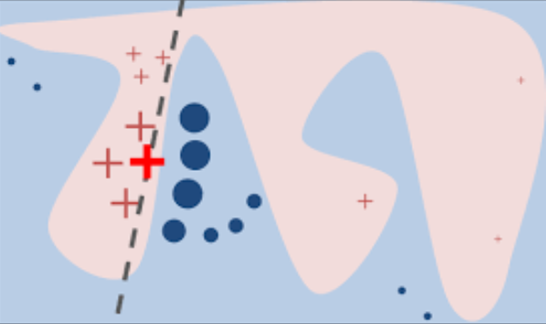

# explainable-ai-papers-list

## shap [PDF](/pdf/SHAP.pdf)

**Summary:** 

* shap是通过组合输入的策略来得到每一个feature的重要性. 比较好的例子如下：通过有猫和无猫输入到网络中，通过输入的差值就能得出“有猫”的重要性  

## Lime [PDF](/pdf/LIME.pdf)

**Summary:** 

* lime是通过线性模型去逼近网络的决策过程，其可解释的核心是线性模型对于每个feature的权重w   

